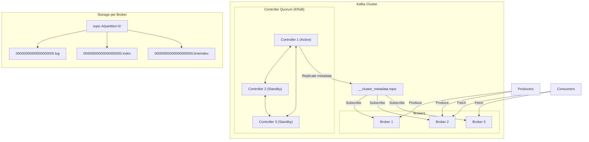
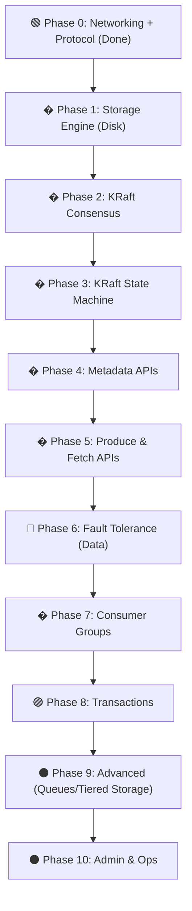

# 🦀 Forge-Kafka — Clone Kafka 4.0 (KRaft Era) bằng Rust

> Mục tiêu: Tự build một distributed event streaming platform từ đầu bằng Rust,
> dựa trên kiến trúc Apache Kafka 4.0 (2025) — **KRaft mode, không ZooKeeper**.

---

## Tổng quan kiến trúc Kafka 4.0



---

## Phase 0: Foundation — Networking & Protocol

> Nền tảng TCP server + Kafka binary wire protocol parser.
> **Lưu ý**: Phải implement đầy đủ các kiểu dữ liệu "lẩu thập cẩm" (Int32 vs Varint, String vs CompactString) để tương thích với Kafka Client.

### [x] 0.1 — TCP Server Framework
- [x] Async TCP server dùng `tokio`
- [x] Accept multiple connections đồng thời
- [x] Mỗi connection: loop đọc Kafka frames `[4-byte size][message]`
- [x] Graceful shutdown

### [x] 0.2 — Kafka Wire Protocol: Encoding/Decoding
**Modern First Strategy**: Ưu tiên tối đa các kiểu dữ liệu hiện đại (Varint, Compact) cho data path. Các kiểu cũ (Int32, String thường) chỉ implement tối thiểu để pass handshake ban đầu.

- **Bắt buộc (Legacy nhưng không thể bỏ)**:
  - [x] `Int32`: Dùng cho **Packet Size** (4 bytes đầu tiên của mọi request).
  - [x] `Int16`: Dùng cho **API Key** & **API Version** (header).
  - [x] `String` (2-byte length): Dùng duy nhất cho **Client ID** lúc handshake.

- **Trọng tâm (Modern & Tối ưu)**:
  - [x] **Varint / Varlong**: Dùng cho tất cả số liệu trong Message Body (v2+).
  - [x] **Compact String**: Dùng cho mọi string trong KRaft & Modern APIs.
  - [x] **Compact Array**: Dùng cho mọi danh sách trong Modern APIs.
  - [x] **UUID**: Dùng định danh Topic/Partition (nhanh hơn String tên topic).
  - [ ] **Tagged Fields**: Dùng cho extensibility *(Ghi chú: Sẽ implement sau khi cần thiết mở rộng các API phức tạp)*.

-> **Chiến lược**: Implement đủ bộ type, nhưng logic xử lý sẽ ép Client dùng **Flexible Version** (Compact) ngay sau khi handshake xong. Code clean và tối ưu cho path này.

### [x] 0.3 — Request/Response Framework
- [x] Parse `RequestHeader` (v0–v2): `api_key`, `api_version`, `correlation_id`, `client_id`
- [x] Build `ResponseHeader`: `correlation_id`, `tagged_fields` *(Ghi chú: Tạm thời chỉ có correlation_id, tagged_fields ghép vào sau)*.
- [x] Request router: dispatch theo `api_key` → handler
- [x] Error handling: `UNSUPPORTED_VERSION (35)` cho version không hợp lệ

---

## Phase 1: Storage Engine — Commit Log (Đã hoàn thành)

> Móng nhà đã được đổ xong 100%! Chúng ta đã tạo ra một Engine Ghi Đĩa siêu tốc độ, hoạt động đúng chuẩn Zero-Copy và Append-only của Kafka. Đạt được:
> - Tái tạo chính xác cấu trúc nhị phân `RecordBatch` và `Record` (Zero wasted bytes).
> - Sinh thuật toán Encoding Varint/Varlong siêu nén.
> - Thiết kế module `Segment` ôm sát Ổ cứng thông qua `tokio::fs` (Fixed size).
> - Triển khai lõi thuật toán cuốn sổ `PartitionLog` (Segment Rolling & Base Offset File Naming).

### [x] 1.1 — Log Segment File Format
- Mỗi partition = 1 directory chứa nhiều segment files
- Mỗi segment gồm 3 files:
  - `.log` — chứa RecordBatches
  - `.index` — offset → byte position mapping (sparse index)
  - `.timeindex` — timestamp → offset mapping

### [x] 1.2 — RecordBatch Format (on-disk)
```
RecordBatch:
  baseOffset: int64          (8 bytes)
  batchLength: int32         (4 bytes)
  partitionLeaderEpoch: int32
  magic: int8                (= 2 cho Kafka 4.0)
  crc: uint32                (CRC-32C từ attributes đến hết batch)
  attributes: int16          (compression, timestamp type, transactional, etc.)
  lastOffsetDelta: int32
  baseTimestamp: int64
  maxTimestamp: int64
  producerId: int64
  producerEpoch: int16
  baseSequence: int32
  recordsCount: int32
  records: [Record...]
```

### [x] 1.3 — Record Format (within batch)
```
Record:
  length: varint
  attributes: int8
  timestampDelta: varlong
  offsetDelta: varint
  keyLength: varint
  key: bytes
  valueLength: varint
  value: bytes
  headersCount: varint
  headers: [Header...]
```

### [x] 1.4 — Log Append (Write Path)
- [x] Append RecordBatch vào active segment
- [x] Update `.index` file (mỗi N records, sparse)
- [x] Update `.timeindex` file
- [x] fsync policy: configurable (every message vs. periodic)
- [x] Segment rolling: khi segment đạt `log.segment.bytes` (default 1GB)

### [x] 1.5 — Log Read (Read Path)voi
- [x] Tìm segment chứa offset cần đọc (binary search trên segment names)
- [x] Dùng `.index` file để tìm byte position gần nhất
- [x] Scan từ position đó đến target offset
- [ ] Zero-copy optimization: `sendfile()` syscall qua `tokio::fs` *(Sẽ implement thực tế ở Phase 5.2 Fetch API)*

### [x] 1.6 — Log Retention, Cleanup & Compaction
- [x] Time-based & Size-based retention
- [x] Background cleanup thread chạy periodic (Đã có lõi `enforce_retention`, Thread sẽ tích hợp ở Application level sau)
- [ ] Log Compaction (giữ lại record cuối cùng cho mỗi key) - *Deferred to later phase if needed*

---

## Phase 2: KRaft Consensus — Tự quản lý Cluster

> Thay thế ZooKeeper hoàn toàn. Đây là bộ não phân tán của Kafka 4.0, dùng Storage Engine (Phase 1) để ghi log.

### [x] 2.1 — Raft Consensus Implementation
- [x] Implement Raft protocol (hoặc dùng library như `openraft` / tự viết core loop)
- [x] 3 roles: Leader, Follower, Candidate
- [x] Leader election qua term-based voting
- [x] Log replication: leader replicate metadata entries đến followers

### [x] 2.2 — Controller Quorum
- Một subset brokers đóng vai trò controllers
- Active controller = Raft leader
- Standby controllers = Raft followers (hot standby, near-instant failover)

### [x] 2.3 — Metadata Topic (`__cluster_metadata`)
- Internal topic chứa tất cả cluster state (Ghi bằng Storage Engine Phase 1)

### [x] 2.4 — Raft Log Snapshotting & Compaction
- Cắt bỏ log cũ (truncate_prefix) để tránh log grow vô hạn.
- Cung cấp tính năng gửi và nhận InstallSnapshot RPC.

---

## Phase 3: KRaft State Machine — Cluster Metadata

> Play lại (Replay) các log từ KRaft (Phase 2) để xây dựng Trạng thái hiện tại của Cluster trên RAM.

### [x] 3.1 — In-Memory Metadata Tracking
- Cấu trúc `ClusterMetadataCache`: theo dõi `brokers`, `topics`, `partitions` và replicas.
- Dịch các `MetadataRecord` (RegisterBroker, Topic, Partition) thành state trên RAM.

### [x] 3.2 — Log Replayer
- Replay tuần tự các RecordBatch từ chuỗi Log của `__cluster_metadata` để reconstruct lại `ClusterMetadataCache`.
- Giữ được `last_applied_offset` làm checkpoint.

### [x] 3.3 — Snapshot Generation
- Sinh file snapshot (serialize `ClusterMetadataCache` thành tập hợp các `MetadataRecord` cô đọng nhất).
- Kích hoạt `truncate_prefix` của Storage Engine để dọn dẹp các tệp log cũ sau khi snapshot thành công.

---

## Phase 4: Core APIs — Metadata & Discovery

> Cái Vỏ API để Client giao tiếp với Cluster. Trực tiếp chọc vào State Machine (Phase 3). CHÍNH THỨC NỐI MẠNG!

### [ ] 4.1 — ApiVersions (api_key = 18)
- Trả về danh sách tất cả API keys được hỗ trợ + min/max version
- Là API đầu tiên client gọi khi kết nối

### [ ] 4.2 — DescribeTopicPartitions (api_key = 75)
- Trả về metadata chi tiết cho một hoặc nhiều topics từ `ClusterMetadata`
- Handle cases: topic tồn tại, topic không tồn tại, multiple topics
- Trả `UNKNOWN_TOPIC_OR_PARTITION` error khi cần

### [ ] 4.3 — Admin APIs (Create/Delete Topics)
- `CreateTopics (api_key = 19)`: Validate yêu cầu, đẩy lệnh tạo Topic vào KRaft Leader (Phase 2), chờ replicate xong mới báo Client.
- `DeleteTopics (api_key = 20)`: Tương tự, đẩy lệnh xóa vào Quorum.

---

## Phase 5: Produce & Fetch APIs

> Mở cửa cho Client gửi và nhận dữ liệu thật sự.

### [ ] 5.1 — Produce API (api_key = 0)
- Parse request, validate topic/partition tồn tại qua State Machine.
- Append thẳng luồng byte vào Commit Log (Phase 1) của Partition tương ứng.
- Acknowledgment Levels (`acks=0`, `1`, `all`).
- Idempotent Producer validation.

### [ ] 5.2 — Fetch API (api_key = 1)
- Đọc messages từ commit log (Phase 1) trả về cho Client.
- Long Polling: Chờ (`max_wait_ms`) nếu chưa đủ data.
- Fetch tối ưu hiệu năng băng thông bằng sendfile zero-copy.

---

## Phase 6: Replication & Fault Tolerance (Data)

> Đảm bảo data của người dùng không mất khi node chết (Raft ở Phase 2 chỉ lo cho Metadata, phần này lo cho Data).

### [ ] 6.1 — Partition Leader/Follower Model
- Tất cả reads/writes đi qua leader
- Leader track ISR (In-Sync Replicas)

### [ ] 6.2 — Data Log Replication
- Followers gửi `Fetch` request rỗng đến leader (giống consumer nhưng internal)
- Leader reply với new records, Follower append vào local log
- Quản lý `high_watermark`.

---

## Phase 7: Consumer Groups — New Protocol (KIP-848)

> Quản lý tập hợp Consumer cùng đọc một Topic (Server-side rebalancing).

### [ ] 7.1 — Group Coordinator
- Quản lý membership, assignment, offsets.
- Lưu states vào `__consumer_offsets` internal topic.

### [ ] 7.2 — Server-Side Rebalancing (Kafka 4.0)
- Cooperative incremental rebalancing.
- Heartbeat-based member liveness detection.

### [ ] 7.3 — Offset Management
- `OffsetCommit` (api_key = 8) & `OffsetFetch` (api_key = 9).

---

## Phase 8: Transactions (Exactly-Once Semantics)
- Transaction Coordinator & `__transaction_state` internal topic.
- Two-phase commit logic.

## Phase 9: Advanced Features (Kafka 4.0 exclusive)
- Share Groups / Queues (KIP-932).
<!-- - Tiered Storage (S3, GCS). -->

## Phase 10: Admin & Operations
<!-- - Configuration System & Dynamic configs. -->
<!-- - Authentication & Authorization (SASL, ACL). -->
<!-- - Metrics Endpoint. -->

---

## Kiến trúc code Rust đề xuất

```
Forge/
├── Cargo.toml                       # [workspace] members = ["forge", "user_app"]
│
├── forge/                           # 📦 Library crate — toàn bộ Kafka logic
│   ├── Cargo.toml
│   └── src/
│       ├── lib.rs                   # pub mod core, application, adapters, protocol, consensus, shared, config
│       ├── config.rs                # BrokerConfig: log.segment.bytes, retention, acks...
│       │
│       ├── core/                    # 🔵 Domain — pure logic, KHÔNG phụ thuộc bên ngoài
│       │   ├── domain.rs            # Structs: RecordBatch, Record, Topic, Partition, Offset
│       │   ├── error.rs             # KafkaError, ErrorCode enum
│       │   └── ports/
│       │       ├── driving.rs       # trait BrokerService { produce, fetch, create_topic... }
│       │       └── driven.rs        # trait LogStorage, trait MetadataStore
│       │
│       ├── application/             # 🟢 Use Cases — orchestrate domain + ports
│       │   ├── produce_handler.rs   # Produce: validate → append log → response
│       │   ├── fetch_handler.rs     # Fetch: find offset → read log → response
│       │   ├── metadata_handler.rs  # ApiVersions, DescribeTopicPartitions, CreateTopics
│       │   ├── group_coordinator.rs # Consumer group management, rebalancing
│       │   └── txn_coordinator.rs   # Transaction state machine
│       │
│       ├── adapters/                # 🟡 Adapters — concrete implementations
│       │   ├── driving/             # Inbound (bên ngoài gọi vào)
│       │   │   └── tcp_server.rs    # TCP listener, Kafka frame parsing, request routing
│       │   └── driven/              # Outbound (hệ thống gọi ra ngoài)
│       │       └── storage/         # impl LogStorage bằng disk
│       │           ├── segment.rs   #   Log segment (.log + .index + .timeindex)
│       │           ├── log.rs       #   Partition log (manages multiple segments)
│       │           ├── record_batch.rs  # RecordBatch on-disk format
│       │           ├── index.rs     #   Sparse offset index
│       │           ├── compaction.rs#   Log compaction
│       │           └── retention.rs #   Log retention cleanup
│       │
│       ├── protocol/                # 🟠 Shared — Kafka wire format (dùng bởi cả driving lẫn driven)
│       │   ├── types.rs             # varint, compact_string, compact_array, uuid...
│       │   ├── request.rs           # RequestHeader parsing
│       │   └── response.rs          # ResponseHeader building
│       │
│       ├── consensus/               # 🟣 KRaft — Raft consensus cho cluster metadata
│       │   ├── state.rs             # Raft state machine
│       │   ├── election.rs          # Leader election
│       │   └── replication.rs       # Metadata log replication
│       │
│       └── shared/                  # 🔧 Utils, helpers dùng chung
│
└── user_app/                        # 🚀 Binary crate — demo / chạy broker
    ├── Cargo.toml                   # [dependencies] forge = { path = "../forge" }
    └── src/
        └── main.rs                  # Wiring: DiskLog + BrokerApp + TcpServer → run
```

---

## Thứ tự thực hiện đề xuất




| Màu | Độ khó | Phases |
|-----|--------|--------|
| 🟢 Xanh | Cơ bản — Vỏ bọc, parsing | Phase 0, 4 |
| 🟡 Vàng | Trung bình — Core storage & data path | Phase 1, 5 |
| 🔴 Đỏ | Khó — Distributed Systems | Phase 6, 7 |
| 🟣 Tím | Rất khó — Consensus thuật toán & Transaction | Phase 2, 3, 8 |
| ⚫ Xám | Nâng cao — Production ready features | Phase 9, 10 |

---

## Lĩnh vực kiến thức

| Lĩnh vực | Từ Phase | Kafka-specific hay General? |
|---|---|---|
| Network programming (TCP, binary protocol) | Phase 0 | General |
| Serialization / Deserialization (wire format) | Phase 0 | General |
| Storage engine design (append-only log, sparse index) | Phase 2 | **Cả hai** — áp dụng được cho database |
| OS-level optimization (zero-copy, mmap, fsync) | Phase 2, 4 | General |
| Batching & compression trade-offs | Phase 3 | General |
| Distributed coordination (consumer groups, rebalancing) | Phase 5 | **Kafka-specific** |
| Data replication & consistency (ISR, high watermark) | Phase 6 | General distributed systems |
| Consensus algorithms (Raft) | Phase 7 | **Core distributed systems** |
| Exactly-once semantics & 2-phase commit | Phase 8 | General |
| Queue vs. streaming semantics | Phase 9 | **Kafka 4.0 mới nhất** |
| Authentication, authorization (SASL, ACL, TLS) | Phase 10 | General |


